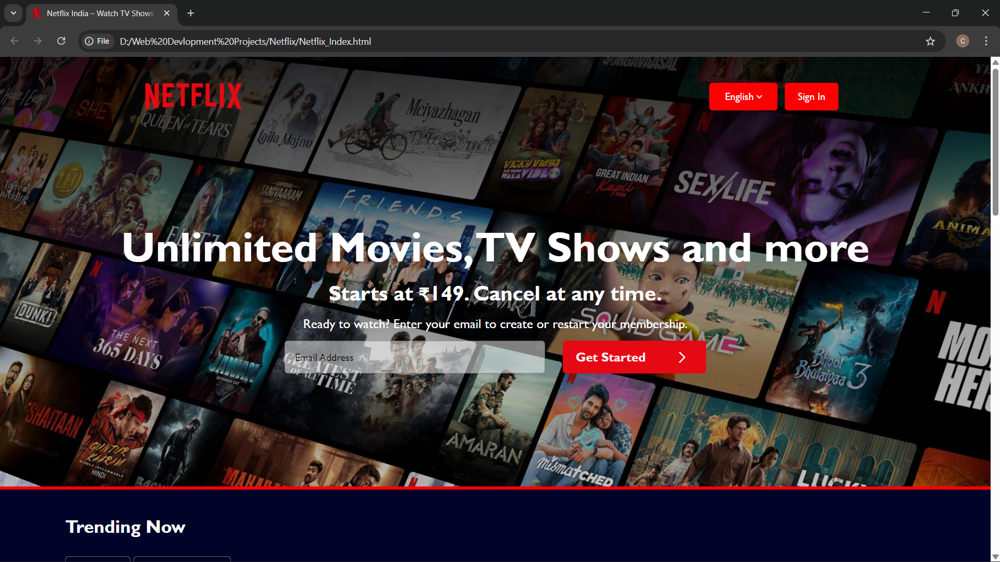

# 🎬 Netflix UI Clone

<p align="center">
  
</p>
A visually appealing **Netflix-inspired UI Clone** built using **HTML and CSS**.  
This project recreates the look and feel of the Netflix homepage with modern layout, movie thumbnails, banners, and responsive styling.

---

## 📌 Project Overview

This project focuses on **frontend UI development** by replicating the interface of a popular streaming platform.  
It demonstrates skills in **layout design, responsive styling, and modern UI structuring** using pure HTML and CSS.

The goal of this project was to practice **real-world UI cloning** and improve frontend development fundamentals.

---

## 🚀 Features

- 🎥 Netflix-style homepage layout  
- 🖼️ Movie/series thumbnail cards  
- 🎬 Hero banner section  
- 📱 Responsive design  
- 🎨 Modern UI styling using CSS  
- 🧭 Clean and structured layout

---

## 🛠️ Tech Stack

- **HTML5** – Structure of the webpage  
- **CSS3** – Styling and layout design

---

## 📂 Project Structure

```
Netflix-UI-Clone
│
├── index.html
├── style.css
├── Assets/
│   ├── images
│   └── icons
└── README.md
```

---

## 🎯 Learning Outcomes

- Improved understanding of **HTML page structuring**
- Practiced **CSS layout techniques**
- Learned how to replicate **real-world UI designs**
- Strengthened **frontend development fundamentals**

---

## 📌 Future Improvements

- Add **JavaScript for interactivity**
- Implement **movie hover effects**
- Add **dynamic content loading**
- Improve **mobile responsiveness**

---

## 🤝 Contributing

Contributions are welcome!  
If you have suggestions or improvements, feel free to fork the repository and create a pull request.

---

## 📜 License

This project is created for **educational and practice purposes only** and is not affiliated with Netflix.
